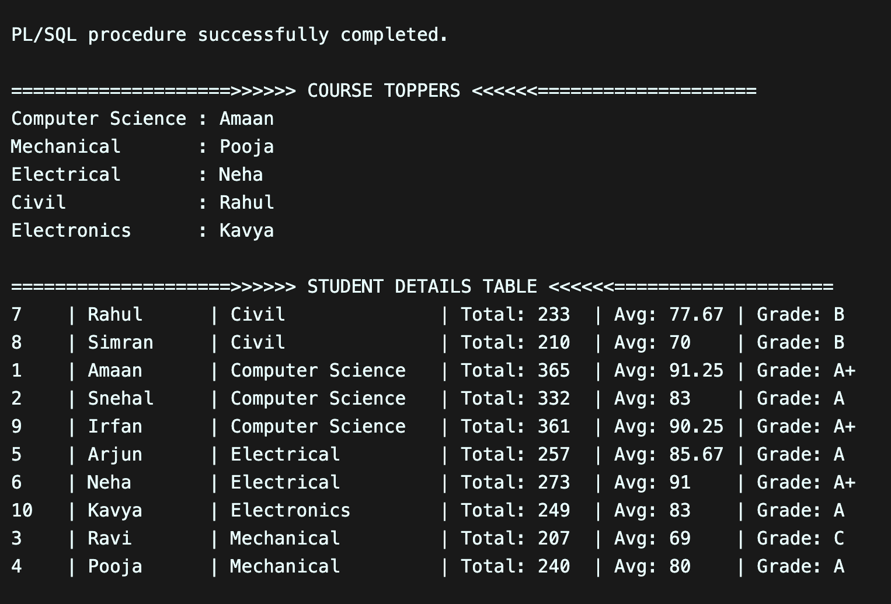
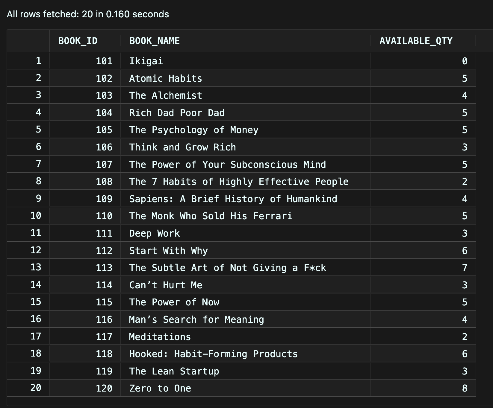
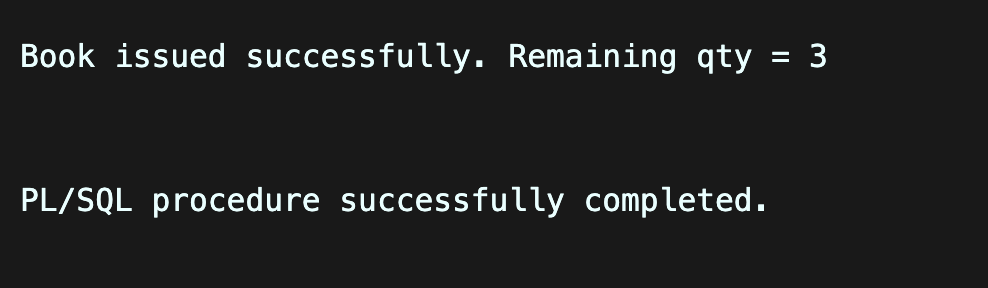
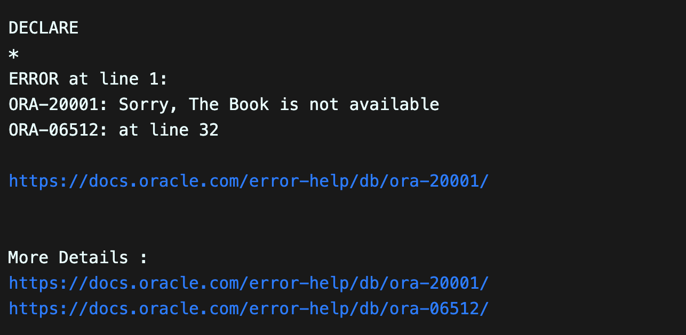
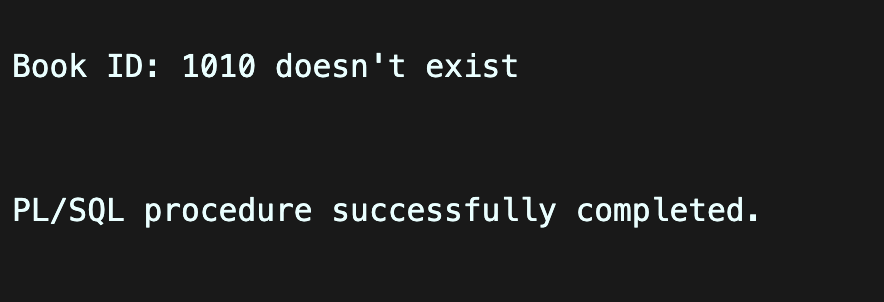
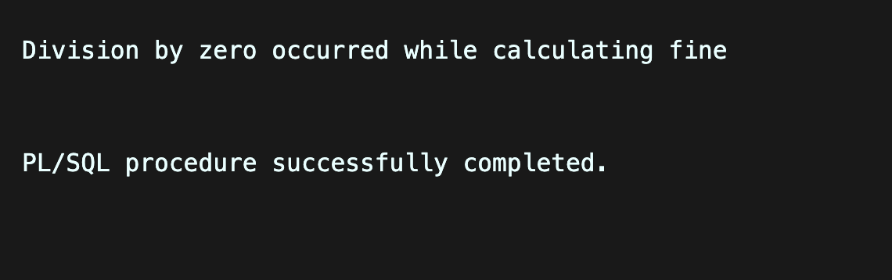
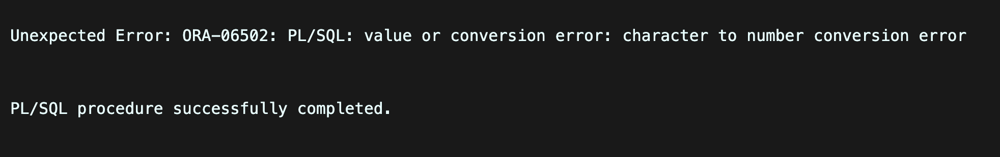
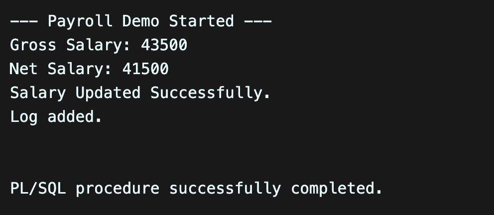
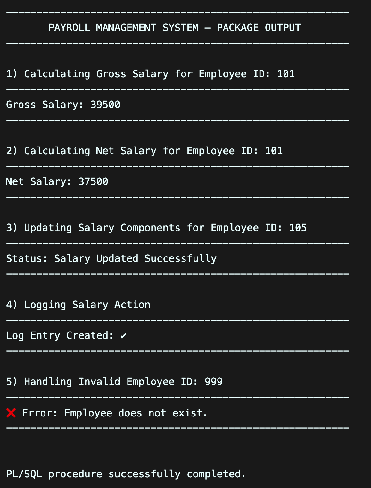

## 1. Functions in PL/SQL – Student Performance System

## 2. Exception Handling in PL/SQL – Library Book Issue System
### 📌 Books Table

### ✅ Successful Book Issue

### ❌ Out of Stock – User-Defined Exception

### ❌ No Data Found – Invalid Book ID

### ❌ Division by Zero – ZERO_DIVIDE Exception

### ❌ Unexpected Error – WHEN OTHERS

## 3. Packages in PL/SQL – Employee Payroll System
### Demo Output

### Final Output

